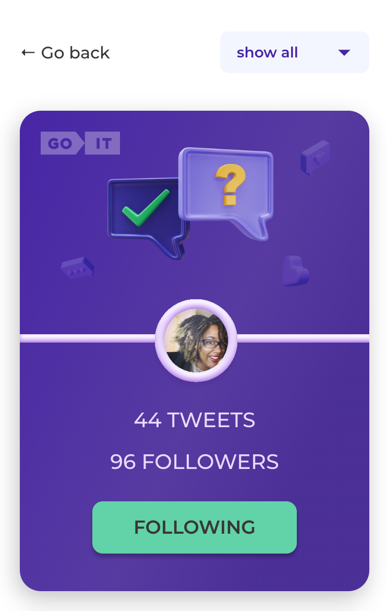
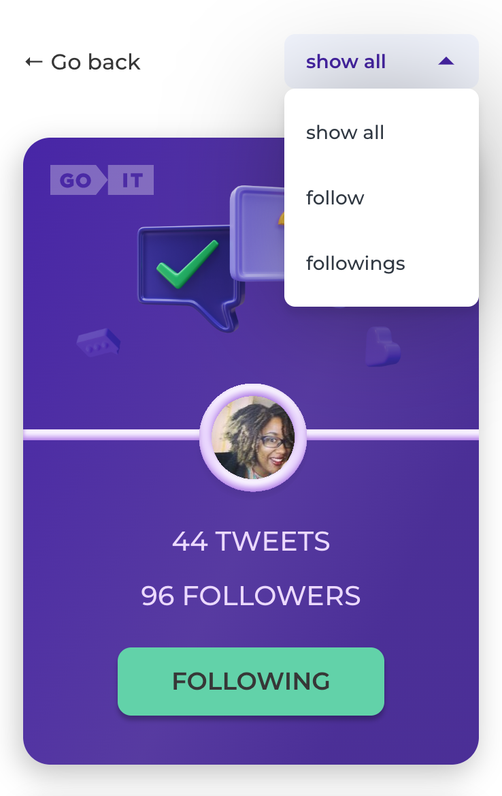

# TWEETS REACT

## It's a tweets site.

Project setup:

```
npm install
npm start
```

### `npm start`

Runs the app in the development mode.\
Open [http://localhost:3000/tweets-react-test](http://localhost:3000/tweets-react-test) to view it in your browser.

---

If you want to follow a particular tweet, you don't need to click the "Follow" button. The button will change to "Following".

<p align="center">

</p>

---

You can also filter tweets using the dropdown list

<p align="center">

</p>
